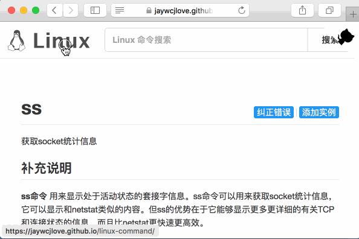

Linux Command
--- 

[](https://jaywcjlove.github.io/linux-command/) [](http://weibo.com/pc175)

516 个 Linux 命令大全，内容包含 Linux 命令手册、详解、学习，值得收藏的 Linux 命令速查手册。请原谅我写了个爬虫，爬了他们家的数据[linuxde.net](http://man.linuxde.net)，同时进行了编辑，增加了一些数据。对他们的辛勤劳动表示敬意，个人希望能本地离线搜索，不喜欢广告，希望得到干净漂亮的预览界面，业余和工作时间需要使用大量的命令，所以干了一件看似比较愚蠢的事情，在回头有空的时候估计能做一个App？，或者是命令行帮助工具？但目前还没有计划...

预览搜索：**https://git.io/linux**

[](https://jaywcjlove.github.io/linux-command/)

## 目录

- [Linux命令分类](#linux命令分类)
  - [文件管理](#文件管理) File Management
  - [文件传输](#文件传输) File Transfer
  - [文档编辑](#文档编辑) File Editor
  - [备份压缩](#备份压缩) File Compression
  - [系统管理](#系统管理) System Management
  - [系统设置](#系统设置) System Settings
  - [网络通讯](#网络通讯) Network Communication
  - [磁盘管理](#磁盘管理) Disk Management
  - [磁盘维护](#磁盘维护) Disk Maintenance
  - [设备管理](#设备管理) Device Commands
  - [电子邮件与新闻组](#电子邮件与新闻组)
  - [其他命令](#其他命令) Misc Commands
- [Node调用](#node调用)

- [Linux学习资源整理](#linux学习资源整理)
 - [社区网站](#社区网站) 
 - [知识相关](#知识相关) 
 - [软件工具](#软件工具) 
 - [中国开源镜像站点](#中国开源镜像站点) 


## Linux命令分类

*这里存放Linux 命令大全并不全，你可以通过[linux-command](https://jaywcjlove.github.io/linux-command/)来搜索，它是把 [command](./command) 目录里面搜集的命令，生成了静态HTML并提供预览以及索引搜索。*

### 文件传输

bye、ftp、ftpcount、ftpshut、ftpwho、ncftp、tftp、uucico、uucp、uupick、uuto

### 备份压缩

ar、bunzip2、bzip2、bzip2recover、compress、cpio、dump、gunzip、gzexe、gzip、lha、restore、tar、unarj、unzip、zip、zipinfo

### 文件管理

diff、diffstat、file、find、git、gitview、ln、locate、lsattr、mattrib、mc、mcopy、mdel、mdir、mktemp、mmove、mread、mren、mshowfat、mtools、mtoolstest、mv、od、paste、patch、rcp、rhmask、rm、slocate、split、tee、tmpwatch、touch、umask、whereis、which、cat、chattr、chgrp、chmod、chown、cksum、cmp、cp、cut、indent

### 磁盘管理

cd、df、dirs、du、edquota、eject、lndir、ls、mcd、mdeltree、mdu、mkdir、mlabel、mmd、mmount、mrd、mzip、pwd、quota、quotacheck、quotaoff、quotaon、repquota、rmdir、rmt、stat、tree、umount

### 磁盘维护

badblocks、cfdisk、dd、e2fsck、ext2ed、fdisk、fsck.ext2、fsck、fsck.minix、fsconf、hdparm、losetup、mbadblocks、mformat、mkbootdisk、mkdosfs、mke2fs、mkfs.ext2、mkfs、mkfs.minix、mkfs.msdos、mkinitrd、mkisofs、mkswap、mpartition、sfdisk、swapoff、swapon、symlinks、sync

### 系统设置

alias、apmd、aumix、bind、chkconfig、chroot、clock、crontab、declare、depmod、dircolors、dmesg、enable、eval、export、fbset、grpconv、grpunconv、hwclock、insmod、kbdconfig、lilo、liloconfig、lsmod、minfo、mkkickstart、modinfo、modprobe、mouseconfig、ntsysv、passwd、pwconv、pwunconv、rdate、resize、rmmod、rpm、set、setconsole、setenv、setup、sndconfig、SVGAText Mode、timeconfig、ulimit、unalias、unset

### 系统管理

adduser、chfn、chsh、date、exit、finger、free、fwhois、gitps、groupdel、groupmod、halt、id、kill、last、lastb、login、logname、logout、logrotate、newgrp、nice、procinfo、ps、pstree、reboot、renice、rlogin、rsh、rwho、screen、shutdown、sliplogin、su、sudo、suspend、swatch、tload、top、uname、useradd、userconf、userdel、usermod、vlock、w、who、whoami、whois

### 文档编辑

col、colrm、comm、csplit、ed、egrep、ex、fgrep、fmt、fold、grep、ispell、jed、joe、join、look、mtype、pico、rgrep、sed、sort、spell、tr、uniq、wc

### 网络通讯

dip、getty、mingetty、ppp-off、smbd(samba daemon)、telnet、uulog、uustat、uux、cu、dnsconf、efax、httpd、ifconfig、mesg、minicom、nc、netconf、netconfig、netstat、ping、pppstats、samba、setserial、shapecfg(shaper configuration)、smbd(samba daemon)、statserial(status ofserial port)、talk、tcpdump、testparm(test parameter)、traceroute、tty(teletypewriter)、uuname、wall(write all)、write、ytalk、arpwatch、apachectl、smbclient(samba client)、pppsetup

### 设备管理

dumpkeys、loadkeys、MAKEDEV、rdev、setleds

### 电子邮件与新闻组

archive、ctlinnd、elm、getlist、inncheck、mail、mailconf、mailq、messages、metamail、mutt、nntpget、pine、slrn、X WINDOWS SYSTEM、reconfig、startx(start X Window)、Xconfigurator、XF86Setup、xlsatoms、xlsclients、xlsfonts

### 其他命令

yes

### Node调用

```
npm install linux-command
```


```js
var comm = require("linux-command")
console.log("---->",comm.ls)

```


## Linux学习资源整理


### 社区网站

- [Linux中国](https://linux.cn/) - 各种资讯、文章、技术
- [实验楼](https://linux.cn/) - 免费提供了Linux在线环境，不用在自己机子上装系统也可以学习Linux，超方便实用。
- [鸟哥的linux私房菜](http://linux.vbird.org/) - 非常适合Linux入门初学者看的教程。
- [Linux公社](http://linux.vbird.org/) - Linux相关的新闻、教程、主题、壁纸都有。
- [Linux Today](http://www.linuxde.net) - Linux新闻资讯发布，Linux职业技术学习！。

### 知识相关

- [Linux思维导图整理](http://www.jianshu.com/p/59f759207862)
- [Linux初学者进阶学习资源整理](http://www.jianshu.com/p/fe2a790b41eb)
- [Linux 基础入门（新版）](https://www.shiyanlou.com/courses/1)
- [【译】Linux概念架构的理解](http://www.jianshu.com/p/c5ae8f061cfe) [En](http://oss.org.cn/ossdocs/linux/kernel/a1/index.html)
- [Linux 守护进程的启动方法](http://www.ruanyifeng.com/blog/2016/02/linux-daemon.html)
- [Linux编程之内存映射](https://www.shiyanlou.com/questions/2992)
- [Linux知识点小结](https://blog.huachao.me/2016/1/Linux%E7%9F%A5%E8%AF%86%E7%82%B9%E5%B0%8F%E7%BB%93/)
- [10大白帽黑客专用的 Linux 操作系统](https://linux.cn/article-6971-1.html)

### 软件工具

- [超赞的Linux软件](https://www.gitbook.com/book/alim0x/awesome-linux-software-zh_cn/details) Github仓库[Zh](https://github.com/alim0x/Awesome-Linux-Software-zh_CN) [En](https://github.com/VoLuong/Awesome-Linux-Software)
- [程序员喜欢的9款最佳的Linux文件比较工具](http://os.51cto.com/art/201607/513796.htm)
- [提高 Linux 开发效率的 5 个工具](http://www.codeceo.com/article/5-linux-productivity-tools.html)
- [你要了解的11款面向Linux系统的一流备份实用工具](http://os.51cto.com/art/201603/508027.htm)
- [16个很有用的在线工具](http://www.simlinux.com/archives/264.html)

### 中国开源镜像站点

- 网易开源镜像站：http://mirrors.163.com/
- 搜狐开源镜像站：http://mirrors.sohu.com/
- 北京交通大学：http://mirror.bjtu.edu.cn/cn/ <教育网荐>
- 兰州大学：http://mirror.lzu.edu.cn/ <西北高校FTP搜索引擎>
- 厦门大学：http://mirrors.xmu.edu.cn/
- 上海交通大学：http://ftp.sjtu.edu.cn/
- 清华大学：http://mirrors.tuna.tsinghua.edu.cn/
  - http://mirrors.6.tuna.tsinghua.edu.cn/
  - http://mirrors.4.tuna.tsinghua.edu.cn/
- 天津大学：http://mirror.tju.edu.cn/
- 中国科学技术大学：http://mirrors.ustc.edu.cn/ 
  - http://mirrors4.ustc.edu.cn/ <教育网、电信>
  - http://mirrors6.ustc.edu.cn/ <IPv6 only>
- 西南大学：http://linux.swu.edu.cn/swudownload/
- 泰安移动：http://mirrors.ta139.com/
- 东北大学：http://mirror.neu.edu.cn/
- 浙江大学：http://mirrors.zju.edu.cn/
- 东软信息学院：http://mirrors.neusoft.edu.cn/